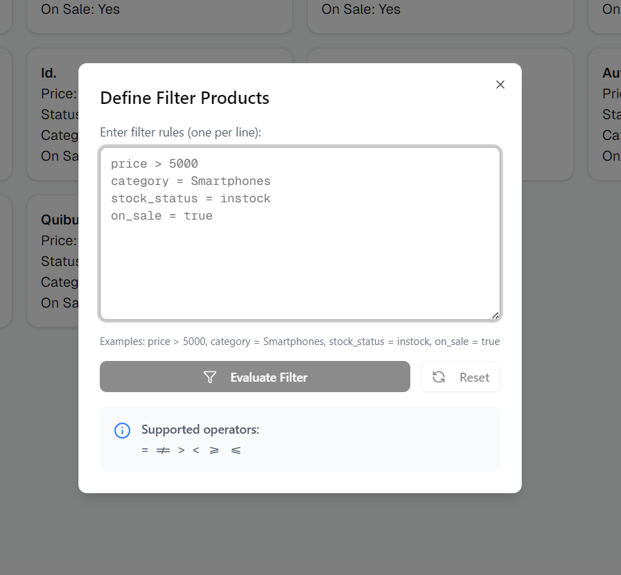
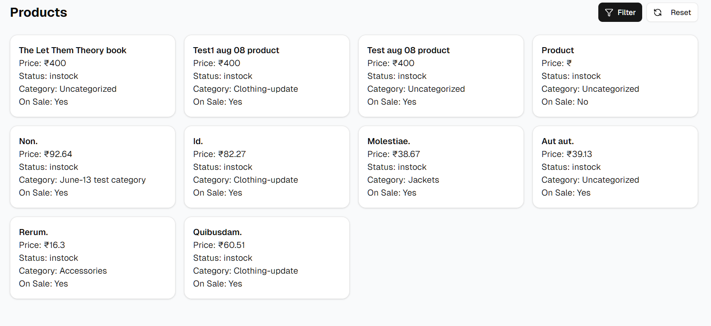

# ConvertCart Product Segmentation

A microservices architecture for e-commerce product segmentation and management.

## Demo

### Screenshots




### Video Demo

[Watch the demo video](https://www.awesomescreenshot.com/video/45058048?key=7e927cfd8969f1b4f6cd4b0c5e07d64b)

## Live Deployments

### Frontend

-   **URL**: [https://convertcart-assignment.onrender.com/](https://convertcart-assignment.onrender.com/)

### Microservices

-   **Product Service**: [https://convertcart-product-service.onrender.com/](https://convertcart-product-service.onrender.com/)
-   **Segment Service**: [https://convertcart-assignment-segment-service.onrender.com/](https://convertcart-assignment-segment-service.onrender.com/)

### API Documentation

-   **Product Service Swagger**: [https://convertcart-product-service.onrender.com/api-docs/](https://convertcart-product-service.onrender.com/api-docs/)
-   **Segment Service Swagger**: [https://convertcart-assignment-segment-service.onrender.com/api-docs/](https://convertcart-assignment-segment-service.onrender.com/api-docs/)

## Architecture Overview

This project implements a microservices architecture with three main components:

1. **Frontend**: Next.js application providing the user interface
2. **Product Service**: Handles product data management and WooCommerce integration
3. **Segment Service**: Manages customer segmentation rules and evaluation

The system is containerized using Docker and can be deployed as a complete stack or individual services.

## Technologies Used

### Frontend

-   Next.js 15.5
-   React 19.1
-   Tailwind CSS
-   Radix UI Components

### Backend Services

-   Node.js with Express
-   TypeScript
-   MongoDB (for product storage)
-   Swagger for API documentation

### DevOps

-   Docker & Docker Compose
-   Environment-based configuration

## Setup and Installation

### Prerequisites

-   Node.js (v18+)
-   Docker and Docker Compose
-   MongoDB (if running locally without Docker)

### Environment Variables

Create a `.env` file in the root directory with the following variables:

```
# MongoDB Configuration
MONGO_USERNAME=your_mongo_username
MONGO_PASSWORD=your_mongo_password

# WooCommerce Integration
WOO_BASE_URL=your_woocommerce_url
WOO_CONSUMER_KEY=your_woocommerce_key
WOO_CONSUMER_SECRET=your_woocommerce_secret
```

### Running with Docker Compose (Recommended)

Build and start all services:

```bash
docker-compose up -d
```

Access the services:

-   Frontend: http://localhost:3000
-   Product Service: http://localhost:3001
-   Segment Service: http://localhost:3002

### Running Services Individually

#### Frontend

```bash
cd frontend
npm install
npm run dev
```

#### Product Service

```bash
cd product-service
npm install
npm run dev
```

#### Segment Service

```bash
cd segment-service
npm install
npm run dev
```

## Deployment Guide

### Render Deployment

1. Create a new Web Service on Render
2. Connect your GitHub repository
3. Configure each service with the following:
    - **Build Command**:
        - Frontend: `cd frontend && npm install && npm run build`
        - Product Service: `cd product-service && npm install && npm run build`
        - Segment Service: `cd segment-service && npm install && npm run build`
    - **Start Command**:
        - Frontend: `cd frontend && npm start`
        - Product Service: `cd product-service && npm start`
        - Segment Service: `cd segment-service && npm start`
4. Set the required environment variables for each service
5. Deploy

### Docker Deployment

For deploying with Docker to a cloud provider:

1. Build the Docker images:

    ```bash
    docker-compose build
    ```

2. Push the images to a registry (like Docker Hub)

3. Deploy using your cloud provider's container services

## API Documentation

Detailed API documentation is available via Swagger UI:

-   Product Service: http://localhost:3001/api-docs/ (when running locally)
-   Segment Service: http://localhost:3002/api-docs/ (when running locally)

## Features

-   Product data synchronization with WooCommerce
-   Dynamic customer segmentation based on product attributes
-   Real-time segment evaluation
-   RESTful APIs with Swagger documentation
-   Containerized deployment for scalability

## License

ISC
